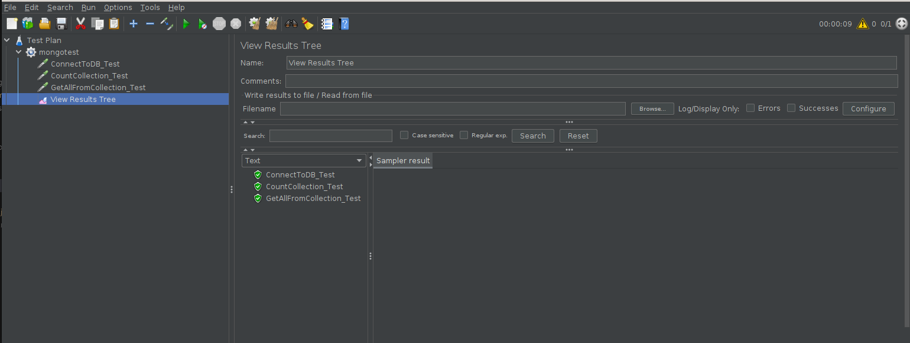
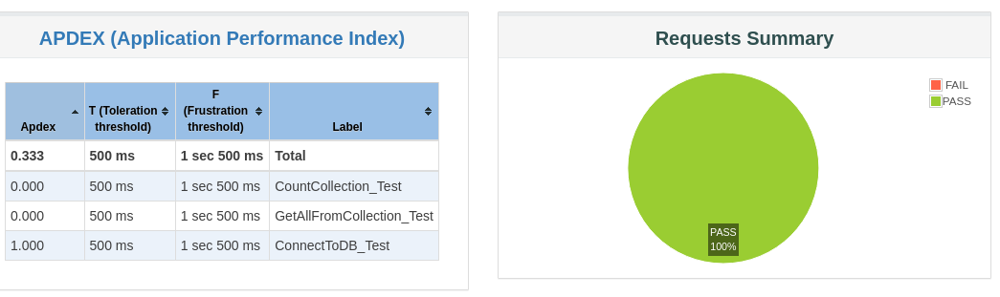
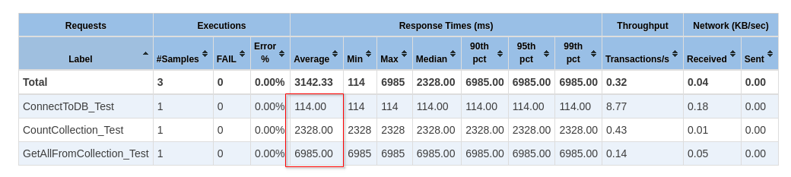
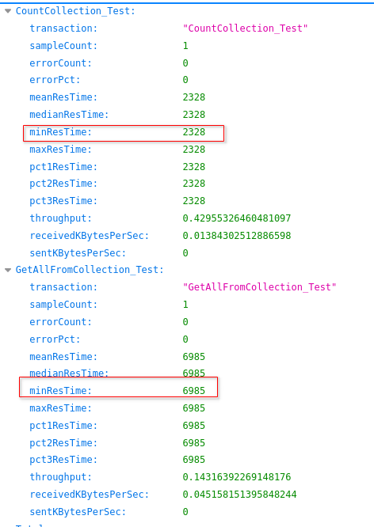
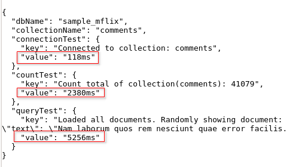

# MongoDB Test

This repo contains 2 ways to test (performance test) MongoDB.
1. using JMeter
2. using a Java Application


## JMeter
3 types of test cases are written in the [ww_mongo_test.jmx](https://github.com/alinahid477/jmeter-tests/blob/main/jmeter/ww_mongo_test.jmx) file:
- ConnectToDB_Test: Established connection to a Mongo DB. Gets a Database. Then gets a Collection.
- CountCollection_Test: Uses the previously retrived collection counts the number of documents in the collection (eg: performs `collection.countDocuments()`).
- GetAllFromCollection_Test: Uses the previously retrieved collection performs a query to retrieve all documents (and loads into an array using `collection.find().into(placeholder_array);`). Then a randomly picked document is passed to the output.


This Jmeter test takes 3 input (as variable) in order to perform the above tests:

- connectionString: The fully formed url (including username/password) of the mongodb server. eg: `mongodb+srv://[mongouser]:[password]@[serverurl]` or `mongodb://[mongouser]:[password]@[serverurl]:[port]`
- databaseName: name of the database
- collectionName: name of the collection to perform queries (as described above) on.

***Note: the [ww_mongo_test.jmx](https://github.com/alinahid477/jmeter-tests/blob/main/jmeter/ww_mongo_test.jmx) does not contain any write test. In other words, it only performs read operation***


### Installing JMeter in a local envionment

- Download JMeter from [Apache JMeter](https://jmeter.apache.org/download_jmeter.cgi). I downloaded the binaries only distro.
- Unpack/Unzip it in a directory. In my case it was `~/dev/jmeter`.
- (optional) Create a soft link `sudo ln -s ~/dev/jmeter/bin/jmeter /usn/bin/jmeter`

##### Run JMeter test using UI
- place the jar files from jmeter/jars to jmeter installed/unpacked lib directory. `cp ~/dev/mongo-test/jars/*.jar ~/dev/jmeter/lib/`.
- run jmeter. eg: jmeter or sudo jmeter
- When JMeter UI window loads open the [ww_mongo_test.jmx](https://github.com/alinahid477/jmeter-tests/blob/main/jmeter/ww_mongo_test.jmx) file and run it.
- You can view the test result by looking at the "View Results Tree".



##### Run JMeter test using command

- edit [ww_mongo_test.jmx](https://github.com/alinahid477/jmeter-tests/blob/main/jmeter/ww_mongo_test.jmx) and change the 3 input variables as mentioned above.
- run the below command:
```
mkdir output
jmeter -n -t output/ww_mongo_test.jmx -l output/output.jtl -e -o output/
```
- this will produce few files in the `output` directory which will show the results.





### Deploy JMeter test in K8s

- [deploment.yaml](jmeter/k8s/deployment.yaml) contains Namespace (jmeter-test), ConfigMap (Jmeter-config of file ww_mongo_test.jmx), Service Account (scc-admin) and RoleBindig for it and depolyment definition of JMeter.
- Edit [deploment.yaml](jmeter/k8s/deployment.yaml) and update the ConfigMap with the 3 input variables (connectionString, databaseName, collectionName) described above.
- `kubectl create -f k8s/deployment.yaml`

The above will:
- Create Namespace called jmeter-test
- Create configmap in that namespace called jmeter-config
- Create Service account called scc-admin and associate appropriate rolebinding to it. This service account will be used to run the jmeter-container pod in privilleged mode.
- Create deployment to deploy jmeter-container pod using image `quay.io/rh-ee-anahid/jmeter-container:1.0.0` (this image is generated using the [jmeter](jmeter/) project). This pod will essentially execute the command `jmeter -n -t output/ww_mongo_test.jmx -l output/output.jtl -e -o output/` inside the pod and output the result in the output dir upon run and enter to 1hr sleep.
- download the output/statstics.json from the pod to local environment using `kubectl exec -n jmeter-test jmeter-container-5cbf4ff6d8-d2nzs -- cat /opt/apache-jmeter-5.6.3/output/statistics.json > statstics.json`




## Java App

Alternative to JMeter This repo has a Java application to perform same tests against mongodb.

The app takes 3 input variables
- name: MONGO_CONNECTION_URI
    value: mongodb+srv://[dbuser]:[userpass]@[serverurl]
- name: MONGO_DB_NAME
    value: [dbname]
- name: MONGO_COLLECTION_NAME
    value: [collection name]

and performs 3 tests (ConnectToDB, CountDocuments in a Collection, GetAllDocuments in a Collection and randomly displaying one in the output) and outputs JSON using get REST API.

### Running the app locally

- pre-requisite: Your local environment must have openjdk-17.
- Set environment variables in the local environment as described above. (eg: export MONGO_DB_NAME=mydb, export MONGO_CONNECTION_URI="mongodb+srv://[mongouser]:[password]@[serverurl]")
- `cd java-app/mongotest`
- `mvn clean package`
- `java -jar target/mongotest-0.0.1-SNAPSHOT.jar`
- This will start the application using embedded tomcat server on port 8080
- Using browser open http://localhost:8080/test/mongo this should output like below




### Deploying the app on K8s

- `cd java-app/mongotest`
- edit [k8s/deployment.yaml](java-app/mongotest/k8s/deployment.yaml) and update the envrionment variables (MONGO_CONNECTION_URI, MONGO_DB_NAME, MONGO_COLLECTION_NAME)
- `kubectl create -f k8s/deployment.yaml`. This will create namespace (called javaapp-test), deploy pod using deployment called mongotest_app and ClusterIP type service called mongotest_app (exposing port 80 maping to 8080 on the pod)
- users can port-forward or create route to expose the service to browse the url http://[service-address]/test/mongo